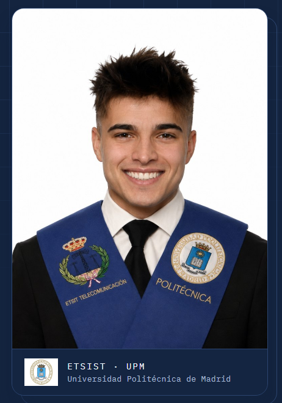

# Guillermo Aladro Abad — Telecommunications Engineering Portfolio

<p align="center">
  
</p>

I am a **Communications Systems Engineer** from the Universidad Politécnica de Madrid (ETSIST-UPM). This repository brings together my academic work in radiofrequency engineering, digital signal processing, radiocommunications, systems software and quantum computing.

The portfolio includes **seven subject areas, 25 laboratory projects and 170 technical files**, with complete reports, MATLAB and Python implementations, C source code, datasets, simulations and result figures.

## Portfolio website

The repository includes a responsive, dependency-free website designed for GitHub Pages:

**[Open the live portfolio](https://guillermoaladro.github.io/student-portfolio-guillermo-aladro/)**

The site can also be previewed locally by opening `index.html` or by running:

```bash
python -m http.server 8000
```

Then visit `http://localhost:8000`.

## Seven academic entries

| # | Subject | Main scope | Projects | Archive |
|---:|---|---|---:|---|
| 01 | Antennas & Electromagnetic Compatibility | Wire, microstrip and aperture antennas | 4 | [Open](subjects/Antenas/) |
| 02 | Operating Systems | Concurrent client-server software in C | 1 | [Open](subjects/Operativos/) |
| 03 | Digital Signal Processing | Sampling, DFT, digital filtering and overlap-save | 4 | [Open](subjects/PDS/) |
| 04 | Communication Signal Processing | Spectral estimation, BER, noise, CORDIC and DDS | 6 | [Open](subjects/PSC/) |
| 05 | Quantum Computing | Quantum fundamentals, teleportation and QFT arithmetic | 3 | [Open](subjects/Quantum_Computing/) |
| 06 | Radiocommunications | Radio links, DVB-T, SDR and LTE coverage | 4 | [Open](subjects/Radio/) |
| 07 | High-Frequency Technologies | PIN switches, microwave filters and amplifiers | 3 | [Open](subjects/TAF/) |

Each subject folder contains its own short guide and the original project files.

## Repository structure

```text
.
├── index.html                 # Portfolio website
├── styles.css                 # Responsive visual system
├── script.js                  # Navigation and progressive interactions
├── assets/
│   ├── documents/             # Curriculum vitae
│   └── images/                # Profile image
├── subjects/                  # Seven academic subject archives
└── .github/workflows/         # Automated GitHub Pages deployment
```

## Technical profile

- **RF and communications:** antennas, propagation, link planning, microwave circuits, SDR and cellular coverage.
- **Signal processing:** spectral estimation, digital filters, stochastic signals, BER, CORDIC and direct digital synthesis.
- **Programming:** MATLAB, Python, C, C++, Java and VHDL.
- **Engineering tools:** FEKO, AWR, Simulink, Qiskit, Altium and ModelSim.
- **Additional background:** generative AI, data structures, algorithms, data science and visualization.

## GitHub Pages deployment

The workflow in `.github/workflows/pages.yml` deploys the static site whenever `main` is updated. In the repository settings, GitHub Pages must use **GitHub Actions** as its source.

## Contact

- Email: [guillermo.aladro@gmail.com](mailto:guillermo.aladro@gmail.com)
- LinkedIn: [guillermo-aladro-abad](https://www.linkedin.com/in/guillermo-aladro-abad-3233783a8/)
- GitHub: [GuillermoAladro](https://github.com/GuillermoAladro)
- CV: [Guillermo Aladro Abad — CV](assets/documents/Guillermo-Aladro-Abad-CV.pdf)
